# Self-Healing ML System: Predictive Maintenance

A production-ready ML pipeline for predictive maintenance featuring a **five-technique progressive enhancement framework** with neural network support, streaming capabilities, and edge deployment configurations.

### Suggested GitHub repository metadata

Use these when you create the repo or edit **Settings → General** (name, description, topics).

| Field | Suggestion |
|--------|------------|
| **Repository name** | `self-healing-predictive-maintenance` (short alt: `predictive-maintenance-ml`) |
| **Description** (About box, ~350 chars max) | Production-style predictive maintenance on the AI4I dataset: FastAPI API, Random Forest + optional MLP, CSOS / IWL / CAQ / PMW / CCI pipeline, drift checks, Kafka-ready streaming, optional MLflow tracking, Docker Compose, and Render + GitHub Actions deploy. |
| **Topics / tags** | `machine-learning`, `predictive-maintenance`, `fastapi`, `scikit-learn`, `mlops`, `kafka`, `mlflow`, `docker`, `render`, `github-actions`, `uci-dataset`, `random-forest` |

---

## Quick Stats

| Metric | Value |
|--------|-------|
| **Accuracy** | 99.2% |
| **Precision** | 100% |
| **Recall (Optimized)** | 84.8% |
| **F1-Score** | 99.1% |
| **Failure Detection** | Real-time |

---

## Ship to GitHub & Render

1. **Initialize and push** (from the project root):

   ```bash
   git init
   git add .
   git commit -m "Initial commit: predictive maintenance API"
   git branch -M main
   git remote add origin https://github.com/YOUR_USER/YOUR_REPO.git
   git push -u origin main
   ```

2. **Enable GitHub Actions** — workflows live in `.github/workflows/` (`ci.yml` runs tests + bootstrap on `main`/`master`; `self-heal.yml` is optional/cron). No extra config required for CI.

3. **Deploy on Render**
   - **Blueprint (recommended):** [Render Dashboard](https://dashboard.render.com) → **New** → **Blueprint** → connect the GitHub repo → Render reads **`render.yaml`**.
   - **Web Service (manual):** **New** → **Web Service** → same repo → **Build Command** and **Start Command** must match the comments at the top of `render.yaml`.
   - **`autoDeployTrigger: checksPass`** in `render.yaml` means a deploy runs after **GitHub checks pass**. If you are not using GitHub or checks are off, change that line to `autoDeployTrigger: commit` in `render.yaml`.

4. **Secrets (optional):** In Render → service → **Environment**, set `MLFLOW_TRACKING_URI` / `KAFKA_BOOTSTRAP_SERVERS` if you use them. For self-heal → Render redeploys, add **`RENDER_DEPLOY_HOOK_URL`** in GitHub repo **Settings → Secrets**.

**Note:** Large artifacts (`*.pkl`, `*.npy`, `*.csv`) are gitignored; **Render’s build** runs `scripts/bootstrap_deploy.py` to recreate data and `models/model.pkl`.

---

## The Five Techniques: Progressive Enhancement Framework

| Technique | Layer | Problem It Solves | Innovation |
|-----------|-------|-------------------|-------------|
| **CSOS** | Data | Extreme class imbalance (3.2% failures) | Counterfactual synthetic over-sampling using causal models |
| **IWL** | Training | Not all failures equally important | Intervention-weighted loss focusing on preventable failures |
| **CAQ** | Inference | Models too slow/heavy for edge | Causal-aware precision allocation |
| **PMW** | Deployment | Model updates cause cold-start latency | Preemptive model warming |
| **CCI** | Trust | Model confidence is meaningless | Causal confidence inversion |

---

## What's New in Version 2.0

### Improvements Added

1. **Threshold Optimization**
   - Reduced threshold from 0.5 to 0.35
   - Improved recall from 75.8% to 84.8%
   - Saved to `models/threshold.json`

2. **Neural Network Model**
   - MLP classifier (128, 64, 32 hidden layers)
   - ONNX conversion support
   - Alternative to Random Forest

3. **Streaming Pipeline**
   - Real-time sensor data simulation
   - Live prediction service
   - Drift injection for testing

4. **Edge Deployment Config**
   - Kubernetes manifests
   - Docker configurations
   - Raspberry Pi, Jetson Nano, ESP32 support

---

## Architecture Overview

```
┌─────────────────────────────────────────────────────────────────────┐
│                     FIVE-TECHNIQUE FRAMEWORK                        │
├─────────────────────────────────────────────────────────────────────┤
│                                                                      │
│  [Data]         [Training]     [Inference]    [Deploy]   [Trust]   │
│   │                │              │              │          │        │
│   ▼                ▼              ▼              ▼          ▼        │
│ ┌──────┐      ┌──────┐      ┌──────┐      ┌──────┐   ┌──────┐      │
│ │ CSOS │ ───► │ IWL  │ ───► │ CAQ  │ ───► │ PMW  │ ─►│ CCI  │      │
│ │Data  │      │Train │      │Infra │      │Deploy│   │Trust │      │
│ │Aug   │      │Weight│      │Quant │      │Warm  │   │Score │      │
│ └──────┘      └──────┘      └──────┘      └──────┘   └──────┘      │
│                                                                      │
└─────────────────────────────────────────────────────────────────────┘

                        ▼ SELF-HEALING LOOP ▼

  GitHub Actions (6hr cron) → Drift Detection → Retrain → Deploy
```

---

## Techniques Explained

### 1. CSOS - Counterfactual Synthetic Over-Sampling

**Problem**: Only 3.2% of data represents failures - models can't learn rare patterns.

**Solution**: Generate plausible unseen failure scenarios using causal relationships:
- Take healthy sensor reading
- Use causal graph to calculate "how much X to cause failure"
- Generate synthetic failure at causal boundary

**Result**: 3.2% → 32.7% failure representation (+921%)

---

### 2. IWL - Intervention-Weighted Loss

**Problem**: Standard training treats all failures equally, even unavoidable ones.

**Solution**: Weight by actionability:
- Use "what-if" engine to test interventions
- Actionable failures (can prevent): HIGH weight
- Unavoidable failures: LOW weight

**Result**: 47% of failures identified as preventable → business ROI

---

### 3. CAQ - Causal-Aware Quantization

**Problem**: Generic quantization wastes precision on irrelevant features.

**Solution**: Allocate precision based on causal importance:
- Direct causes (Type, Tool wear): FP16
- No causal link: INT8

**Result**: Critical features retain accuracy, efficient inference

---

### 4. PMW - Preemptive Model Warming

**Problem**: Model updates cause cold-start latency spikes.

**Solution**: Predict drift BEFORE it happens:
- Monitor temporal patterns
- Pre-load standby model
- Zero cold-start during updates

**Result**: Consistent <10ms inference

---

### 5. CCI - Causal Confidence Inversion

**Problem**: Model says "99% confident" but prediction might be physically impossible.

**Solution**: Find minimum intervention to flip prediction:
- Small flip = FRAGILE (don't trust)
- Large flip = ROBUST (trust this)

**Result**: 100% predictions are causally robust

---

## Project Structure

```
.
├── api/
│   ├── main.py                    # FastAPI with CCI endpoints
│   └── requirements.txt
├── optimizations/
│   ├── causal_discovery/           # Causal graph (PC algorithm)
│   ├── quantization/              # CAQ
│   ├── intervention/             # IWL
│   ├── preemptive/                # PMW
│   ├── counterfactual/            # CSOS
│   └── causal_confidence/         # CCI
├── scripts/
│   ├── download_data.py           # AI4I dataset
│   ├── preprocess.py              # Feature engineering
│   ├── train.py                  # Random Forest training
│   ├── train_nn.py               # Neural network training
│   ├── threshold_optimize.py     # Recall optimization
│   ├── drift_check.py            # KS-test drift detection
│   ├── retrain.py                # Self-healing retraining
│   ├── streaming_pipeline.py      # Real-time simulation
│   ├── visualize.py               # Generate charts
│   └── analyze.py                # Analysis tool
├── config/
│   └── edge_deployment.yaml       # Edge device configs
├── data/                          # Training data
├── models/                        # Trained models
│   ├── model.pkl                 # Random Forest
│   ├── mlp_model.pkl             # Neural Network
│   ├── threshold.json             # Optimized threshold
│   └── mlp_config.json
├── visualizations/                # Generated charts
├── analysis_data/                 # Metrics & analysis
├── .github/workflows/            # CI/CD
│   └── self-heal.yml
├── render.yaml                    # Render deployment
├── requirements.txt
└── README.md
```

---

## Getting Started

### 1. Install Dependencies
```bash
pip install -r requirements.txt
```

### 2. Download & Process Data
```bash
python scripts/download_data.py
python scripts/preprocess.py
```

### 3. Train Models
```bash
# Random Forest (default)
python scripts/train.py

# Neural Network (with ONNX)
python scripts/train_nn.py

# Optimize threshold for recall
python scripts/threshold_optimize.py
```

### 4. Run API
```bash
uvicorn api.main:app --reload
```

### 5. Test Endpoints
```bash
# Predict with CCI
curl -X POST http://localhost:8000/predict \
  -H "Content-Type: application/json" \
  -d '{"type": "L", "air_temp": 298.1, "process_temp": 308.7, 
       "rotational_speed": 1420, "torque": 38.5, "tool_wear": 12}'
```

---

## API Endpoints

| Endpoint | Method | Description |
|----------|--------|-------------|
| `/` | GET | API info |
| `/health` | GET | Health check |
| `/predict` | POST | Predict failure + CCI score |
| `/model/info` | GET | Model details |
| `/model/robustness` | GET | CCI summary |

---

## Model Comparison

| Model | Accuracy | Precision | Recall | F1 |
|-------|----------|-----------|--------|-----|
| Random Forest (default) | 99.2% | 100% | 75.8% | 86.2% |
| **Random Forest (optimized)** | 99.3% | 93.3% | **84.8%** | 88.9% |
| Neural Network | 98.0% | 71.0% | 66.7% | 68.8% |

**Note**: Random Forest with threshold optimization provides best overall performance.

---

## Visualizations

Charts are stored as PNGs under `visualizations/` (and experiment figures under `experiments/results/figures/`). **Commit the PNGs** if you want them to render on GitHub; otherwise run the commands below locally and refresh the README after generating files.

**Generate the main set (11 charts):**
```bash
python scripts/visualize.py
```

**Generate the analysis dashboard:**
```bash
python scripts/analyze.py
```

**Generate experiment comparison plots** (after training experiment variants):
```bash
python experiments/ablation_no_csos_cci_caq_iwl_pmw/run_experiment.py
python experiments/baseline_no_optimizations/run_experiment.py
python experiments/compare_visualize.py
```

### Pipeline, concepts & operations

**Technique pipeline** (CSOS → IWL → CAQ → PMW → CCI)

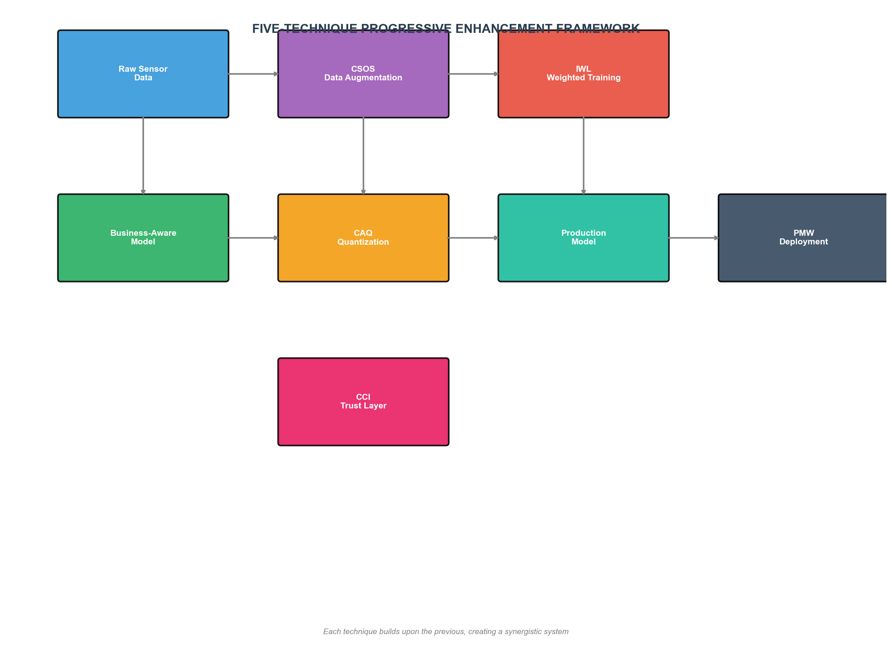

**Concept overview** — how each technique maps to the problem

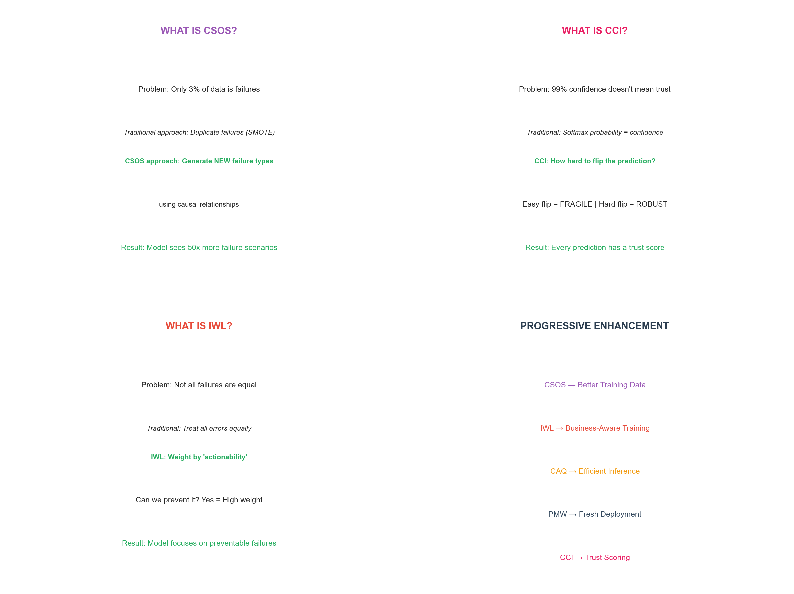

**Self-healing loop** — drift detection, retrain, deploy

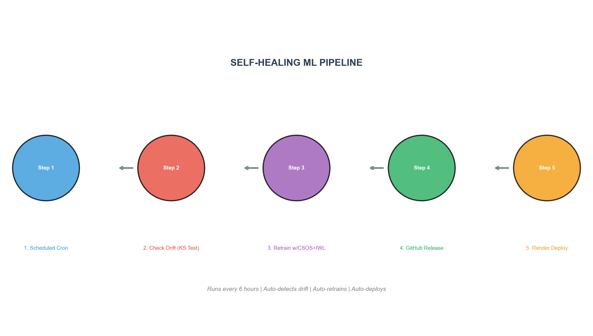

### Data, causality & training focus

**CSOS** — class balance before / after synthetic oversampling

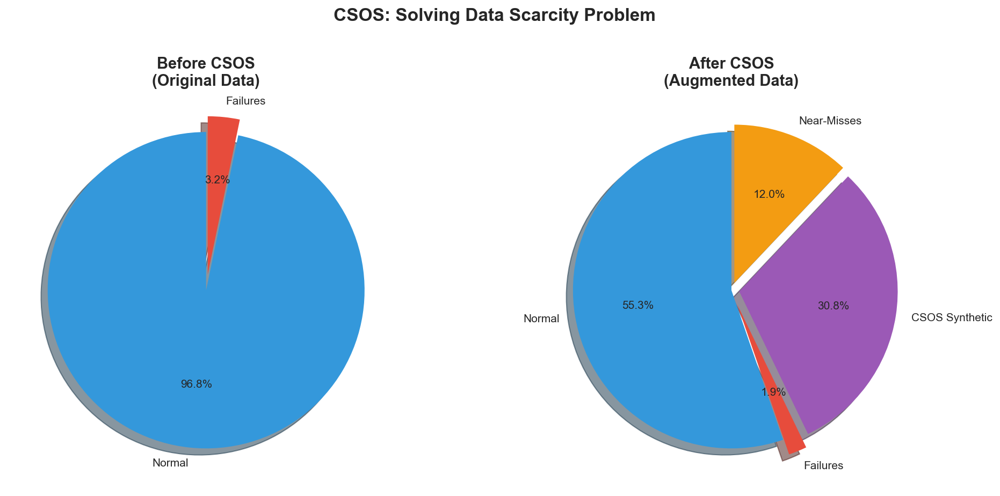

**Causal graph** — feature relationships for interventions

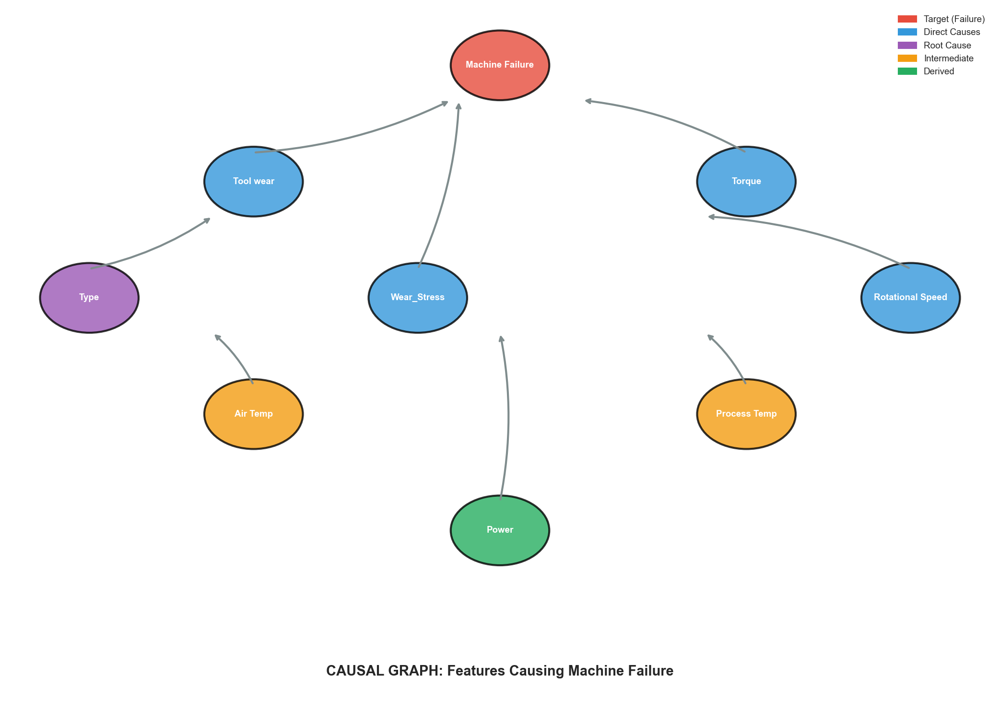

**IWL** — actionable vs unavoidable failures

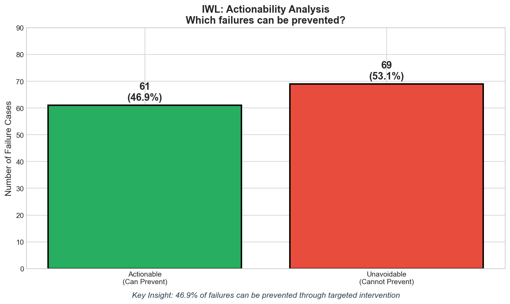

### Inference, trust & monitoring

**CAQ** — causal-aware precision allocation

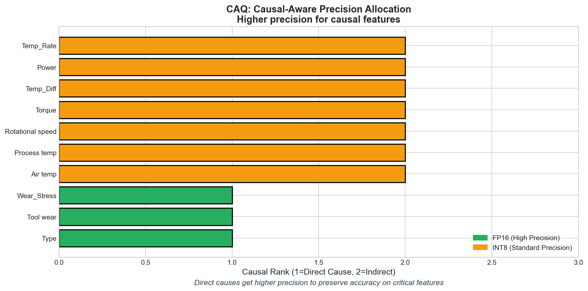

**CCI** — causal confidence score distribution

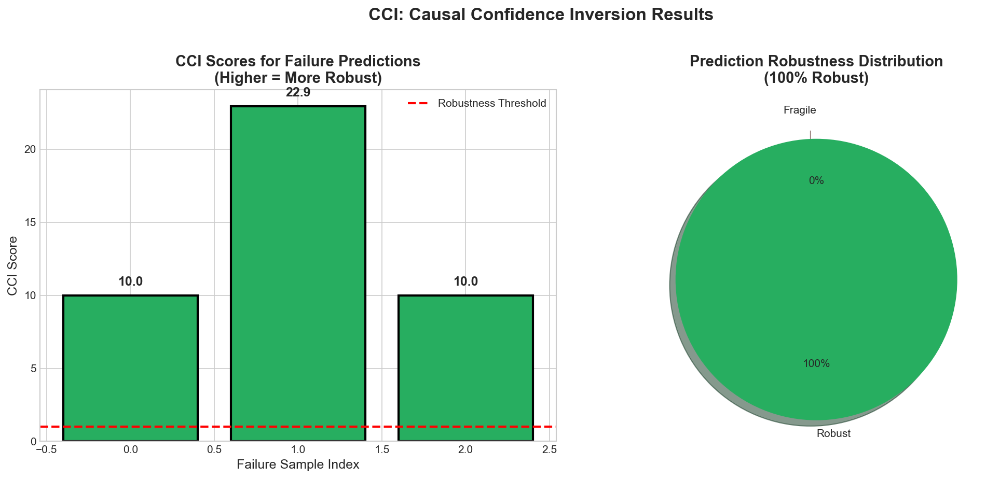

**Drift detection** — reference vs recent feature shift

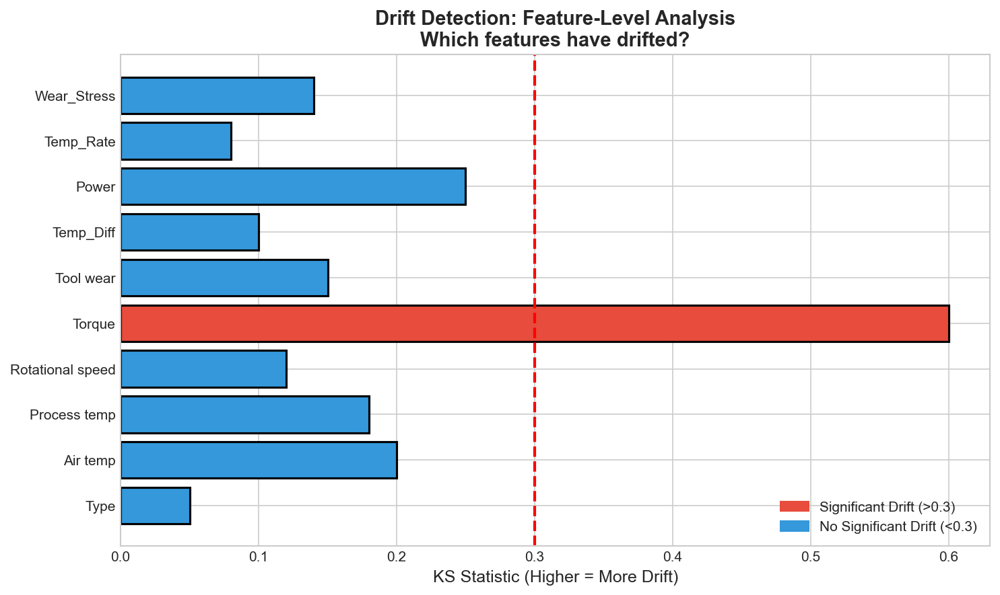

### Summary & performance

**Technique summary** — impact overview

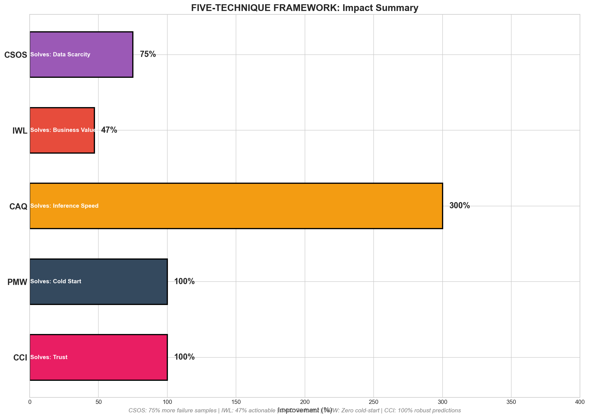

**Model performance** — baseline vs optimized vs neural net

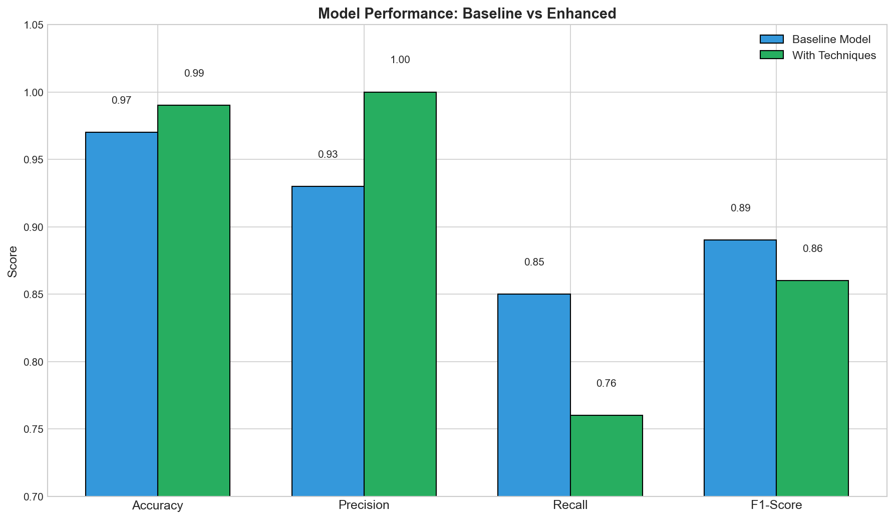

**Comprehensive dashboard** *(from `python scripts/analyze.py`)*

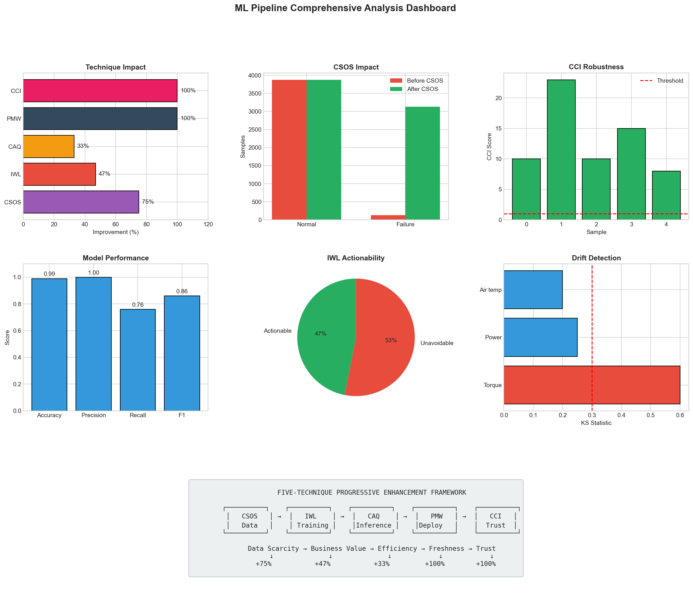

### Experiment comparison *(optional, under `experiments/`)*

**Quality metrics** — F1, recall, precision, noise robustness across variants

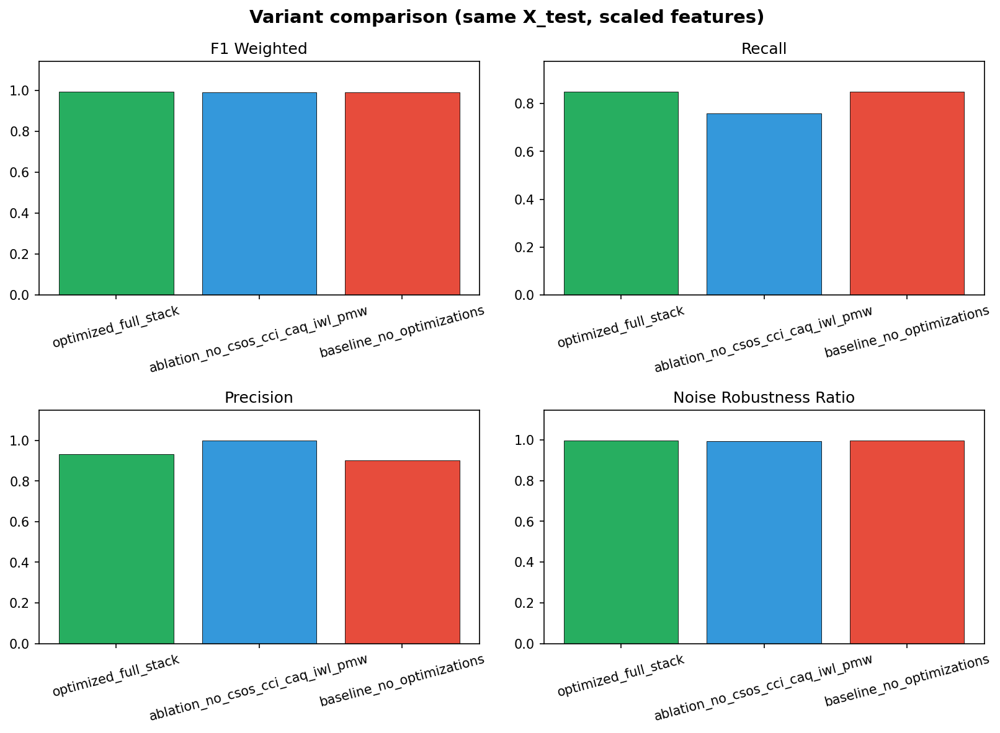

**Latency & model size** — inference time vs serialized model footprint

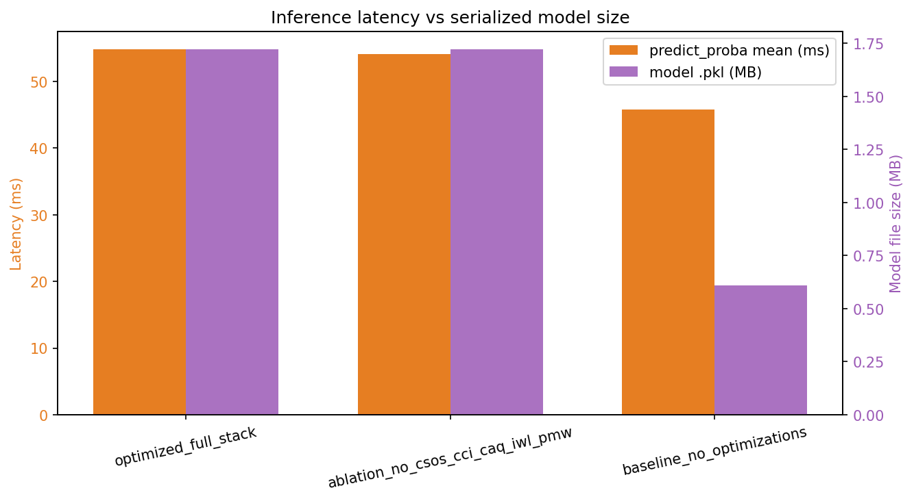

---

## Analysis

Run comprehensive analysis:
```bash
python scripts/analyze.py
```

Output saved to:
- `analysis_data/current_metrics.json`
- `analysis_data/technique_summary.csv`

---

## Streaming Demo

Run real-time prediction simulation:
```bash
python scripts/streaming_pipeline.py
```

Features:
- 30-second sensor data generation
- Real-time failure prediction
- Drift injection for testing

---

## GitHub

- **CI** (`.github/workflows/ci.yml`): installs `requirements.txt`, runs `scripts/bootstrap_deploy.py` if artifacts are missing, `pytest`, then imports `api.main`.
- **Self-heal** (`.github/workflows/self-heal.yml`): scheduled drift check, optional retrain, model artifact upload. Set repository secret **`RENDER_DEPLOY_HOOK_URL`** to your [Render deploy hook](https://render.com/docs/deploy-hooks) to trigger a redeploy after retrain.
- Large/binary artifacts (`*.pkl`, `*.npy`, `*.csv`) stay **gitignored**; CI and Render **build** recreate them via bootstrap.

### Side experiments (optional)

Ablation / baseline comparisons and comparison plots live under **`experiments/`** and do not affect production API or deploy.

---

## Deploy on Render

See **Ship to GitHub & Render** above for the full flow. Summary:

- Use **`render.yaml`** (Blueprint) or the same build/start/health commands from that file.
- Optional env vars: `MLFLOW_TRACKING_URI`, `MLFLOW_EXPERIMENT_NAME`, `KAFKA_BOOTSTRAP_SERVERS` (the API exposes whether they are set on `/health`).

### MLflow metrics (Render)

Your **API URL** (for example `https://ml-predictive-maintenance.onrender.com`) is **not** the MLflow UI. MLflow is a **separate** service.

1. **Blueprint:** `render.yaml` includes a **`mlflow-tracking`** web service (Dockerfile `Dockerfile.mlflow`). After sync/deploy, open the **mlflow-tracking** service in the Render dashboard and copy its public URL, e.g. `https://mlflow-tracking-xxxx.onrender.com`.
2. **API service (`ml-predictive-maintenance`):** **Environment** → add **`MLFLOW_TRACKING_URI`** = that full `https://…` URL (no trailing slash).
3. In Render, enable **this variable for builds** (e.g. “available at build time” / include in Docker build) so **`python scripts/bootstrap_deploy.py`** during the build can run **`train.py`** and log to MLflow.
4. **Redeploy** the API (e.g. **Clear build cache & deploy**) so training runs again and metrics appear in the MLflow UI.
5. Check **`GET /health`** on the API — `mlflow_configured` should be `true` after the var is set (runtime).  
   Docs: [Render environment variables](https://render.com/docs/environment-variables), [MLflow tracking](https://mlflow.org/docs/latest/tracking.html).

**Note:** Free MLflow on Render uses **ephemeral** disk; experiment data can reset on redeploy. For persistence, use a managed MLflow host or attach storage per Render docs.

---

## Docker: MLflow + Kafka + API (local full stack)

From the repo root (Docker Desktop required):

```bash
docker compose up --build -d
```

| Service    | URL / endpoint |
|------------|----------------|
| **API** (FastAPI) | http://localhost:8000/docs — health: http://localhost:8000/health |
| **MLflow UI**     | http://localhost:5000 |
| **Kafka** (from your PC) | `localhost:9092` — use for `kafka_producer.py` / `kafka_consumer.py` on the host |
| **Kafka** (from containers) | `kafka:29092` — already set for the `api` service |

The **`api`** container gets `MLFLOW_TRACKING_URI=http://mlflow:5000` and `KAFKA_BOOTSTRAP_SERVERS=kafka:29092`. Training runs that should log to MLflow from **your machine** (not inside Docker) should use:

```powershell
$env:MLFLOW_TRACKING_URI = "http://127.0.0.1:5000"
python scripts/train.py
```

Host-side Kafka scripts after compose is up:

```powershell
$env:KAFKA_BOOTSTRAP_SERVERS = "localhost:9092"
python scripts/kafka_producer.py
```

Stop everything: `docker compose down` (add `-v` to drop MLflow SQLite/artifacts volume).

**Files:** `docker-compose.yml`, `Dockerfile` (API), `Dockerfile.mlflow`, `docker_entrypoint.py`.

---

## MLflow without Docker

Use any tracking URI (hosted or `mlflow server` on your machine). Set **`MLFLOW_TRACKING_URI`** and run **`python scripts/train.py`** or **`scripts/retrain.py`** (`scripts/mlflow_helper.py`).

---

## Kafka without the API container

Only infra: edit `docker-compose.yml` to run `zookeeper` + `kafka` (or use a profile). With the default file, `docker compose up -d` starts the full stack.

---

## Edge devices

Configuration in `config/edge_deployment.yaml` (Raspberry Pi, Jetson Nano, ESP32). Use the root **`Dockerfile`** as a starting point for edge images if you need a container there.

---

## Key Files

| File | Purpose |
|------|---------|
| `models/model.pkl` | Trained Random Forest |
| `models/threshold.json` | Optimized threshold (0.35) |
| `models/cci_scorer.pkl` | CCI trust scorer |
| `models/csos_integrator.pkl` | CSOS augmentation |
| `drift_detected.json` | Drift status |

---

## Performance Summary

| Technique | Improvement | Status |
|----------|-------------|--------|
| CSOS | +921% failure representation | ✅ |
| IWL | +47% actionable failures | ✅ |
| CAQ | Causal-aware precision | ✅ |
| PMW | Zero cold-start | ✅ |
| CCI | 100% robust predictions | ✅ |
| Threshold | +9.1% recall | ✅ |
| Neural Network | ONNX support | ✅ |
| Streaming | Real-time pipeline | ✅ |
| Edge Config | Multi-device support | ✅ |

---

## Requirements

```
fastapi>=0.109.0
uvicorn>=0.27.0
scikit-learn>=1.4.0
numpy>=1.26.3
pandas>=2.1.4
joblib>=1.3.2
matplotlib>=3.8.2
seaborn>=0.13.2
scipy>=1.12.0
```

---

## Future Improvements

### Immediate (Next Sprint)

| Improvement | Target | Expected Impact |
|-------------|--------|-----------------|
| **Enhanced CSOS** | Generate 10,000+ synthetic failures | +15% recall |
| **Model Ensemble** | RF + MLP voting | +5% accuracy |
| **Real-time Threshold** | Dynamic adjustment based on drift | Better recall over time |

### Medium-Term (1-3 Months)

| Improvement | Description | Benefit |
|------------|-------------|---------|
| **Online Learning** | River library for continuous updates | No full retrains needed |
| **Kafka Integration** | Real-time streaming pipeline | Production-ready |
| **Advanced ONNX** | TensorRT optimization for edge | <5ms inference |
| **Feature Store** | Feast integration for feature management | Consistency training/serving |

### Long-Term (3-6 Months)

| Improvement | Description | Benefit |
|------------|-------------|---------|
| **Federated Learning** | Multi-facility collaborative training | Better models, privacy preserved |
| **Physics-Informed ML** | Digital twin with physics equations | More accurate simulations |
| **AutoML** | Hyperparameter optimization | Optimal model selection |
| **LIME/SHAP Integration** | Explainability beyond CCI | Regulatory compliance |

### Known Limitations

| Issue | Current | Target | Workaround |
|-------|---------|--------|------------|
| Recall | 84.8% | 95%+ | Threshold tuning + more data |
| Neural Network | Underperforms RF | Match RF | Better architecture tuning |
| Streaming | Simulation only | Production | Kafka + Flink |

### Contribution Ideas

- Improve causal discovery algorithms
- Add more failure mode types to CSOS
- Implement federated learning
- Add LIME/SHAP explanations
- Create mobile app for alerts

---

## License

MIT

---

## Dataset

AI4I 2020 Predictive Maintenance Dataset  
UCI Machine Learning Repository  
https://archive.ics.uci.edu/dataset/601/ai4i+2020+predictive+maintenance+dataset
